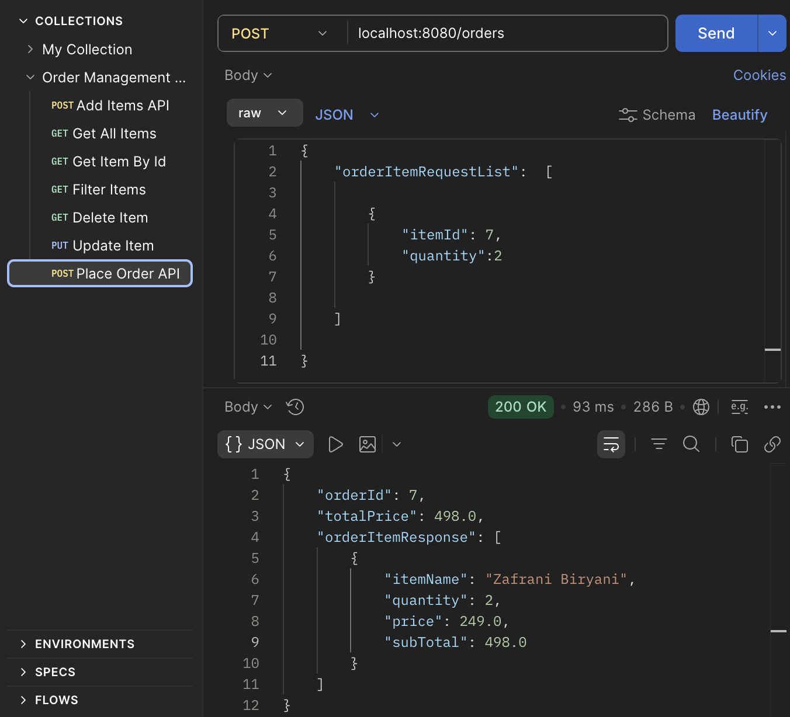
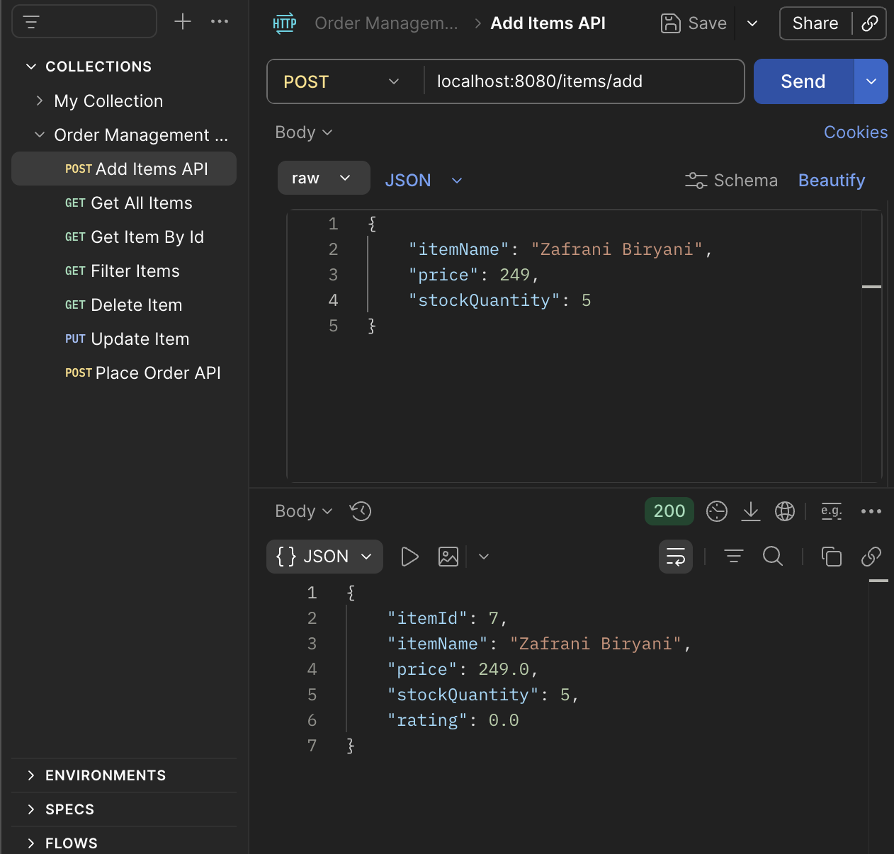
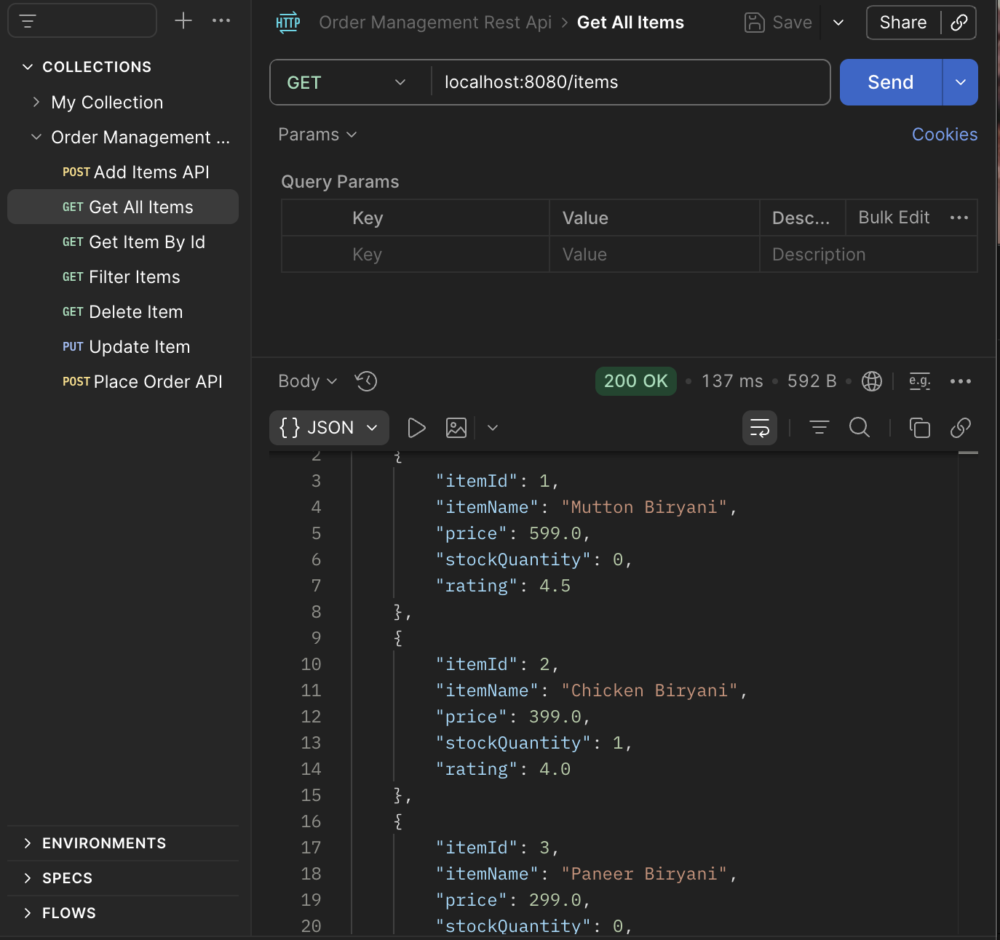
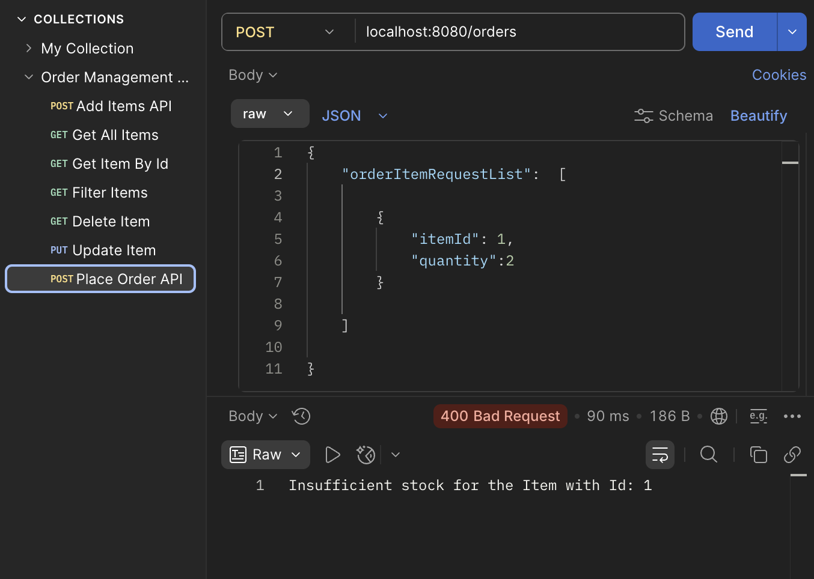

# Order Management REST API

A backend REST API application built using Spring Boot, Spring Data JPA, Hibernate, and MySQL for managing food orders, inventory operations, and stock validation. The application follows layered architecture principles and implements CRUD operations, DTO-based request/response handling, transactional order processing, validation, exception handling, and database integration.

## Tech Stack

* Java 17
* Spring Boot
* Spring Data JPA
* Hibernate
* MySQL
* Maven
* Eclipse / STS
* Postman
* Git & GitHub

---

## Features

### Item Management

* Add new item
* Update item details
* Delete item by ID
* Get item by ID
* Get all items
* Maintain stock quantity

### Order Management

* Place customer orders
* Order multiple items in a single request
* Automatically calculate:
  * Total quantity
  * Item subtotal
  * Final order amount
* Reduce stock quantity after successful order placement
* Prevent orders with insufficient stock
* Maintain Order ↔ OrderItems ↔ Item relationships
* Transactional order processing using `@Transactional`

### DTO Architecture

Separate DTOs implemented for request and response handling to avoid direct entity exposure.

#### Request DTOs

* AddItemRequestDTO
* UpdateRequestDTO
* PlaceOrderRequestDTO
* OrderItemRequestDTO

#### Response DTOs

* ItemResponseDTO
* OrderItemsResponseDTO
* OrderResponseDTO

---

## Validation & Exception Handling

### Custom Exceptions

* ItemNotFoundException
* InsufficientStockException

### Global Exception Handling

Implemented centralized exception handling using:

* `@RestControllerAdvice`
* `GlobalExceptionHandler`

### Validation Features

* Prevent invalid item IDs
* Prevent ordering unavailable stock
* Proper error responses with meaningful messages
* Null-safe request handling

---

## REST API Endpoints

### Item APIs

| Method | Endpoint | Description |
|--------|----------|-------------|
| POST | `/items/add` | Add new item |
| GET | `/items/{id}` | Get item by ID |
| GET | `/items` | Get all items |
| PUT | `/items/{id}` | Update item |
| DELETE | `/items/{id}` | Delete item |

### Order APIs

| Method | Endpoint | Description |
|--------|----------|-------------|
| POST | `/orders` | Place new order |

---

## Sample API Testing

Below are sample API executions tested using Postman.

### Place Order API



### Add Items API



### Get All Items API



### Insufficient Stock Exception



---

## Sample Request Body

### Place Order Request

```json
{
  "orderItemRequestList": [
    {
      "itemId": 1,
      "quantity": 2
    },
    {
      "itemId": 2,
      "quantity": 1
    }
  ]
}
```

---

## Project Structure

```text
order-management-rest-api
│
├── screenshots
│   ├── add-items-api.png
│   ├── get-all-items.png
│   ├── insufficient-stock.png
│   └── place-order-api.png
│
├── src/main/java/com/flmfoods
│   ├── controller
│   │   ├── ItemController.java
│   │   └── OrderController.java
│   │
│   ├── dto
│   │   ├── AddItemRequestDTO.java
│   │   ├── ItemResponseDTO.java
│   │   ├── OrderItemRequestDTO.java
│   │   ├── OrderItemsResponseDTO.java
│   │   ├── OrderResponseDTO.java
│   │   ├── PlaceOrderRequestDTO.java
│   │   └── UpdateRequestDTO.java
│   │
│   ├── exception
│   │   ├── GlobalExceptionHandler.java
│   │   ├── InsufficientStockException.java
│   │   └── ItemNotFoundException.java
│   │
│   ├── model
│   │   ├── Item.java
│   │   ├── Order.java
│   │   └── OrderItems.java
│   │
│   ├── repository
│   │   ├── ItemRepository.java
│   │   └── OrderRepository.java
│   │
│   ├── service
│   │   ├── ItemService.java
│   │   ├── OrderService.java
│   │   └── impl
│   │       ├── ItemServiceImpl.java
│   │       └── OrderServiceImpl.java
│   │
│   └── OrderManagementRestApiApplication.java
│
├── src/main/resources
│   └── application.properties
│
├── pom.xml
├── README.md
└── .gitignore
```

---

## Database Implementation

* Spring Data JPA repositories
* Hibernate ORM mapping
* Entity relationships using:
  * `@OneToMany`
  * `@ManyToOne`
* Transaction management using:
  * `@Transactional`
* Automatic table mapping using JPA annotations

---

## Database Schema

### Item Table

| Column | Type |
|--------|------|
| item_id | INT |
| item_name | VARCHAR |
| price | DOUBLE |
| stock_quantity | INT |

### Orders Table

| Column | Type |
|--------|------|
| order_id | INT |
| total_quantity | INT |
| final_order_price | DOUBLE |

### Order Items Table

| Column | Type |
|--------|------|
| order_item_id | INT |
| quantity | INT |
| unit_price | DOUBLE |
| subtotal | DOUBLE |
| item_id | INT |
| order_id | INT |

---

## API Testing

API endpoints tested using Postman for:

* CRUD operations
* Order placement
* Exception scenarios
* Invalid requests
* Stock validation

---

## How to Run

### Clone Repository

```bash
git clone https://github.com/Harsha-vardhan-7/order-management-rest-api.git
```

### Configure Database

Update MySQL credentials inside:

```text
src/main/resources/application.properties
```

### Build Project

```bash
mvn clean install
```

### Run Application

```bash
mvn spring-boot:run
```

### Test APIs

Use Postman to test API endpoints.

---

## Learning Outcomes

This project strengthened understanding of:

* REST API development
* Spring Boot fundamentals
* Spring Data JPA
* Hibernate entity relationships
* DTO design pattern
* Layered architecture
* Transaction management
* Exception handling
* API testing with Postman
* Database integration
* Clean code practices
* Git and GitHub workflow

---

## Future Improvements

Planned future enhancements:

* Spring Security + JWT Authentication
* Swagger/OpenAPI documentation
* Request validation annotations
* Pagination and filtering
* Docker deployment
* Logging implementation
* Role-based authorization
* Unit and integration testing
